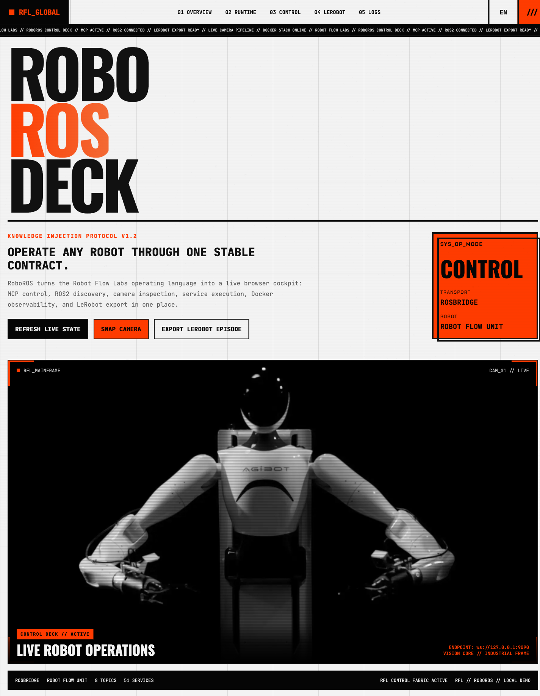
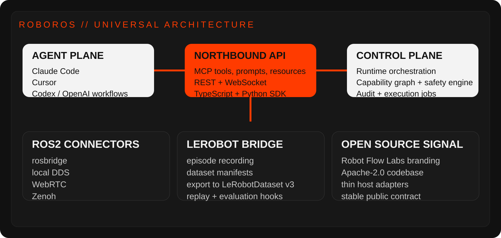

<p align="center">
  
</p>

<p align="center">
  <a href="https://robotflowlabs.com/"></a>
  
  
  
  
</p>

## Why This Exists

RoboROS is the open robotics runtime for **Robot Flow Labs**.

The goal is simple: any serious agent or application should be able to work with a robot through one stable contract.

That means:

- Claude Code
- Cursor
- Codex / OpenAI workflows
- custom agents
- dashboards
- automation systems

All of them should talk to the same runtime, not each to a different one-off plugin.

## Core Direction

- `MCP` is the main northbound interface.
- `ROS2` is the first southbound runtime.
- `LeRobot` is the first learning/data bridge.
- `OpenClaw` becomes a legacy adapter, not the center of the platform.

<p align="center">
  
</p>

## Current Build

This repo already contains:

- a host-neutral runtime package
- a first MCP adapter
- a LeRobot bridge package for dataset manifests
- Codex and Claude-oriented skill guidance
- a first-party Robot Flow Labs Docker demo stack
- scripts to boot, inspect, stop, and smoke-test the live demo

What works today:

- connect to rosbridge
- inspect runtime health
- get one overview snapshot for the active robot
- discover robot capabilities
- list topics
- list services
- publish ROS2 messages
- call ROS2 services
- subscribe once to a topic
- request a camera snapshot

## Quick Start

```bash
pnpm install
pnpm demo
pnpm demo:logs
pnpm build
pnpm dev:mcp
```

Default environment:

- `RFL_TRANSPORT_MODE=rosbridge`
- `RFL_ROSBRIDGE_URL=ws://127.0.0.1:9090`
- `RFL_CAMERA_TOPIC=/robotflow/demo/camera/image_raw/compressed`

Useful checks:

```bash
bash scripts/doctor.sh
pnpm demo:ps
pnpm demo:logs
pnpm demo:shell
pnpm smoke:docker
pnpm demo:down
```

## Docker

RoboROS now ships with its own Robot Flow Labs demo stack.

It does not depend on the upstream AgenticROS Docker setup.

What the demo exposes:

- `/robotflow/demo/heartbeat`
- `/robotflow/demo/camera/image_raw/compressed`
- `/robotflow/demo/cmd_vel_echo`
- `/robotflow/demo/add_two_ints`

One-command validation:

```bash
pnpm smoke:docker
```

That command:

- builds the Robot Flow Labs ROS2 image
- starts rosbridge on `ws://127.0.0.1:9090`
- builds the RoboROS workspace
- verifies the MCP server against the live container

If `9090` is busy, the scripts now tell you what owns the port before they fail.

## Packages

| Package | Purpose |
| --- | --- |
| `@robotflowlabs/runtime-core` | neutral runtime, rosbridge transport, capabilities, safety checks |
| `@robotflowlabs/adapter-mcp` | MCP server exposing RoboROS tools and resources |
| `@robotflowlabs/bridge-lerobot` | LeRobot-compatible episode and dataset manifest primitives |

## Agent Integrations

### Claude Code

- connect to the RoboROS MCP server
- use the universal operator skill in [`skills/roboros-operator/SKILL.md`](./skills/roboros-operator/SKILL.md)
- use the skill in [`skills/claude-robotics/SKILL.md`](./skills/claude-robotics/SKILL.md)
- read `robot://health` and `robot://capabilities` before motion commands

### Cursor

- use the MCP adapter through a standard stdio MCP config
- use the universal operator skill in [`skills/roboros-operator/SKILL.md`](./skills/roboros-operator/SKILL.md)
- use the skill in [`skills/cursor-robotics/SKILL.md`](./skills/cursor-robotics/SKILL.md)
- start from [`examples/integrations/mcp-stdio.example.json`](./examples/integrations/mcp-stdio.example.json)
- start from [`examples/integrations/cursor-mcp.example.json`](./examples/integrations/cursor-mcp.example.json)

### Codex

- use the MCP adapter where available
- use the universal operator skill in [`skills/roboros-operator/SKILL.md`](./skills/roboros-operator/SKILL.md)
- use the skill in [`skills/codex-robotics/SKILL.md`](./skills/codex-robotics/SKILL.md)
- fall back to the SDK and scripts when needed

## Current MCP Surface

- `robots_list`
- `robot_get_overview`
- `robot_get_capabilities`
- `ros2_list_topics`
- `ros2_list_services`
- `ros2_publish`
- `ros2_call_service`
- `ros2_subscribe_once`
- `robot_camera_snapshot`

Resources:

- `robot://health`
- `robot://overview`
- `robot://capabilities`

## Repo Map

```text
RoboROS/
├── packages/
│   ├── runtime-core/
│   ├── adapter-mcp/
│   └── bridge-lerobot/
├── skills/
│   ├── codex-robotics/
│   └── claude-robotics/
├── scripts/
├── examples/
└── assets/
```

## Build Style

This repo is intentionally being rebuilt with a stricter bar than the upstream prototype:

- host-neutral contracts first
- runtime safety outside prompts
- thin adapters instead of host-locked business logic
- MCP-native integration
- LeRobot-compatible data path
- Robot Flow Labs branding and open-source packaging

## Roadmap

### Phase 1

- rosbridge-first runtime
- MCP adapter
- capability discovery
- camera snapshots
- safe publish flow

### Phase 2

- REST and WebSocket adapters
- stronger safety engine
- richer robot capability graph

### Phase 3

- LeRobot episode recording and export
- replay and evaluation hooks
- dataset manifests and tooling

### Phase 4

- Zenoh, WebRTC, and local DDS parity
- legacy OpenClaw adapter
- vendor connectors beyond ROS2

## Open Source

RoboROS is being built as a **Robot Flow Labs** open-source project under **Apache-2.0**.

The code is open.
The interface is meant to be durable.
The platform is meant to be fun to operate and serious enough to trust.
